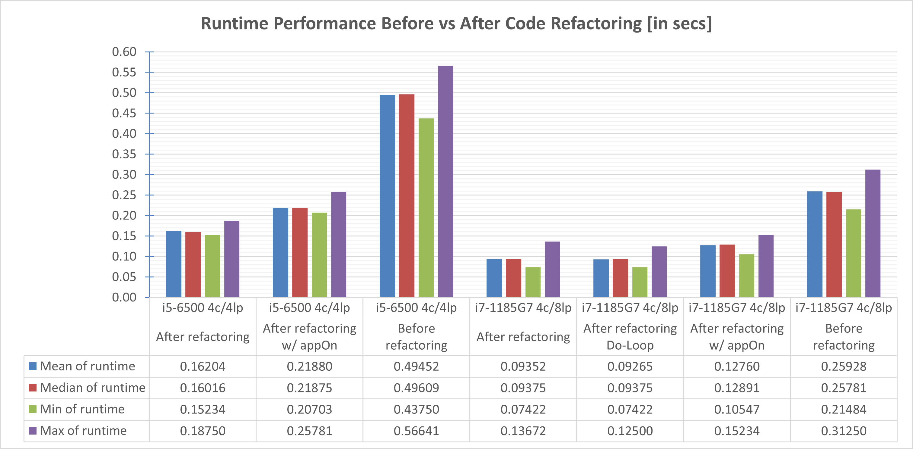

# Stock Analysis with Excel VBA
This project details how we refactor our Excel VBA (Visual Basic for Applications) code that loops through all the data one time to collect the same sets of information and analyze runtime performance for understanding the concepts of code refactoring.

## Table of Contents
- [Overview of Project](#overview-of-project)
  - [Purpose](#purpose)
- [Analysis of Code Refactoring](#analysis-of-code-refactoring)
- [Runtime Performance Analysis](#runtime-performance-analysis)
  - [Results](#results)
- [Summary](#summary)
- [References](#references)

## Overview of Project
In this project we learned how to develop a VBA code with improved readability, reusability and possibly maintainability when working with more complex software projects through refactoring. We recycled part of our early design patterns and relevant pseudocode, cleaned some redundant steps as well as excessively frequent activating and selecting objects, revised some memory inefficient variables/assignments, and confirmed that our refactored code was free of bugs or code smells through debugging.

Module 2 assignment consists of code refactoring exercises and a detailed analysis of how we refactor our VBA code to boost its runtime performance when looping through big datasets. Refactored codes are expected to provide more efficient data visualization without sacrificing the statistical outcomes and quality of data analysis.  
- ☑️ Deliverable 1: Refactor VBA code and measure its performance. This includes snapshots of runtime performance comparison when analyzing 2018 and 2017 green energy stock data as follows.
  - Pre-/post-refactored codes (VBA_Challege.xlsm workbook and VBA_Challenge.vbs)
  - Snapshots of analysis results (VBA_Challenge_2017.png, VBA_Challenge_2018.png, VBA_Runtime_Performance_Analysis.png)
- ☑️ Deliverable 2: A written analysis of code refactoring techniques and the visualization results (this ["README.md"](./README.md))

All deliverables in Module 2 challenge are committed in this GitHub repo as outlined below.  
main branch  
|&rarr; [./README.md](./README.md)  
|&rarr; ./02_wall-street/  
  &nbsp; |&rarr; [./02_wall-street/VBA_Challenge.vbs](./02_wall-street/VBA_Challenge.vbs)  
  &nbsp; |&rarr; [./02_wall-street/VBA_Challenge.xlsm](./02_wall-street/VBA_Challenge.xlsm)  
  &nbsp; |&rarr; ./02_wall-street/resources/  
    &emsp; |&rarr; [./02_wall-street/resources/VBA_Challenge_2017.png](./02_wall-street/resources/VBA_Challenge_2017.png)  
    &emsp; |&rarr; [./02_wall-street/resources/VBA_Challenge_2018.png](./02_wall-street/resources/VBA_Challenge_2018.png)  
    &emsp; |&rarr; [./02_wall-street/resources/VBA_Runtime_Performance_Analysis.png](./02_wall-street/resources/VBA_Runtime_Performance_Analysis.png)  

### Purpose
Our goals are to understand the concepts of code refactoring, compare the runtime performance before vs after refactoring, including two required snapshots, and share a summary report in a GitHub repository (repo) while uncovering various techniques, advantages, and disadvantages of code refactoring.

## Analysis of Code Refactoring
During this analysis, we applied various VBA coding techniques, for example looping through each member of arrays by For...Next, Do...Loop, etc. and optimizing the use of built-in VBA functions and debugging tool. This analysis was done by using a 32-bit Excel version 2206 or newer, and runtime performance before vs after code refactoring was measured on PCs with Intel 6<sup>th</sup>-gen i5/i7 and 11<sup>th</sup>-gen i7 quad cores inside. After hitting the wall at around 0.15234 seconds, breaking our initial design patterns and pseudocode was the only hope to brainstorm other possible optimization approaches against the norm.

Code refactoring sometimes requires redesigning design patterns and pseudocode, and consistent accumulation of tiny improvements throughout the process, which could be time-consuming in certain cases. Besides optimizing the use of `Cells()` instead of `Range()`, numeric indexes instead of quoted string indexes (as in `Columns(2)` instead of `Columns("B")`) wherever possible in our refactored code, several major revisions that further optimized our original design patterns and pseudocode are highlighted below.

💡 Created array with all tickers and three output arrays with more memory efficient data types for avoiding Array() method or [Variant data type](https://docs.microsoft.com/en-us/office/vba/language/reference/user-interface-help/data-type-summary), reducing multiple lines of code for initializing tickers array, and getting rid of about 12x frequent activation/selection of worksheets (refer to _AllStocksAnalysis()_ sub). I also used `Option Explicit` to force explicit declaration of all variables before using them, smaller [Byte data type](https://docs.microsoft.com/en-us/office/vba/language/reference/user-interface-help/data-type-summary), and fewer lines of code to achieve the same outcomes.
```
tickers = Split("AY,CSIQ,DQ,ENPH,FSLR,HASI,JKS,RUN,SEDG,SPWR,TERP,VSLR", ",")
```

💡 Discounted the 1<sup>st</sup> loop of tickers(1<sup>st</sup> tickerIndex) and the last loop of tickers(last tickerIndex) with a single line of code, which let us reduce two loops and several lines in the most tedious For...Next loop. Using `Debug.Print` confirmed that `Dim` initializes each empty value to empty or 0 before we use it, which suggested that "2a) Create a for loop to initialize the tickerVolumes to zero." step was redundant.
```
If Cells(rowStart, 1) = tickers(LBound(tickers)) Then
  tickerStartingPrices(LBound(tickers)) = Cells(rowStart, 6): tickerVolumes(LBound(tickers)) = Cells(rowStart, 8)
End If
```
```
If Cells(rowEnd, 1) = tickers(UBound(tickers)) Then
  tickerEndingPrices(UBound(tickers)) = Cells(rowEnd, 6): tickerVolumes(UBound(tickers)) = tickerVolumes(UBound(tickers)) + Cells(rowEnd, 8)
End If
```

💡 Verified For...Next versus Do...Loop loops and used nested `If` ~ `ElseIF` ~ `End If` alternatives to accurately replicate several consecutive `If` ~ `End If` conditions. We later compared their runtime performance after over 200 test runs, even though we were discouraged.
```
tickerIndex = 0
Do While tickerIndex <= UBound(tickers)
  For i = 3 To (rowEnd - 1)
    If Cells(i, 1) = tickers(tickerIndex) Then
      tickerVolumes(tickerIndex) = tickerVolumes(tickerIndex) + Cells(i, 8)
      If Cells(i - 1, 1) <> tickers(tickerIndex) Then
        tickerStartingPrices(tickerIndex) = Cells(i, 6)
        GoTo nextI
      ElseIf Cells(i + 1, 1) <> tickers(tickerIndex) Then
        tickerEndingPrices(tickerIndex) = Cells(i, 6)
        GoTo nextI
      End If
    End If
nextI:
  Next i
  tickerIndex = tickerIndex + 1
Loop
```

💡 Turned off four built-in [Excel Application properties](https://docs.microsoft.com/en-us/office/vba/api/excel.application(object)) that most of us have probably been applying in our past VBA scripts, for example the popular `Application.DisplayAlerts = False`, which is often used to suppress a pop-up prompt.
```
Sub appOff()
  Application.ScreenUpdating = False
  Application.Calculation = xlCalculationManual
  Application.EnableEvents = False
  Application.DisplayAlerts = False
End Sub
Sub appOn()
  Application.DisplayAlerts = True
  Application.EnableEvents = True
  Application.Calculation = xlCalculationAutomatic
  Application.ScreenUpdating = True
End Sub
```

## Runtime Performance Analysis
Runtime performance before vs after code refactoring was measured by running at least 50 consecutive test runs on PCs with Intel 6<sup>th</sup>-gen i5-6500/i7-6700HQ and later on PC with 11<sup>th</sup>-gen i7-1185G7 quad cores inside. The code was modified to log runtime results in csv format that we could use to identify runtime performance gain per refactoring approach. Our results confirmed significant runtime improvements thanks to our refactored approaches and also helped us reveal a few interesting findings as shown in the following snapshots and summary table.

### Results
Fig. 1-2 show the fastest runtime performance of 0.07422~0.078125 seconds, which was achieved by our refactored code after accumulating some approaches discussed in [Analysis of Code Refactoring](#analysis-of-code-refactoring) for the year 2018 and 2017 green energy stock data, respectively. Our refactored VBA code accumulated about 46-50% on average of the better overall runtime performance, while turning off those four Application properties contributed about 17% of the overall runtime performance improvement. In summary, we revealed that
- our refactored VBA code significantly sped up our analysis time by about 64% on average when running on recent Intel 11<sup>th</sup>-gen i7-1185G7 computer and by about 67% on average when running on Intel 6<sup>th</sup>-gen i5-6500 or i7-6700HQ computers. This suggested that code refactoring helped better on lower computer specs, though recent computer specs seemed to provide extra runtime reduction of 0.06939 seconds, meaning that we could boost another 42% of runtime performance by switching to better computer specs (see **Table 1**). Another option would be switching to 64-bit software.
- Turning off four built-in Excel Application properties alone shortened runtime by about 26-27% compared to keeping the default settings on for those four Application properties.
- The advantage of using Do...Loop instead of For...Next was negligible (only about 1% better), but runtime measurements based on over 200 test runs confirmed that Do...Loop was not a taboo alternative.

\
**Fig. 1 VBA runtime performance for the year 2017**

\
**Fig. 2 VBA runtime performance for the year 2018**

**Table 1** and Fig. 3 provide the visualization of the overall runtime performance comparison. We assumed that 32-bit software, like our current Excel VBA, would only be affected slightly by computer specs, but our results revealed that better computer specs also played a significant role in boosting the overall performance of code refactoring and could further our efficiency and ease certain challenges during the code refactoring process. Being unaware of this limitation was a big mistake when trying to beat the record runtime, which triggered additional experiments and redoing the code refactoring. However, this project has taught us a lot of lessons, and conducting additional researches and measurements are often required to solve problems, even when our initial results turned out to be slightly off.

**Table 1. Runtime Performance Improvement by Code Refactoring**  
| Contribution by                 | i7-1185G7 4c/8lp [secs]  | [%]    | i5-6500 4c/4lp [secs]    | [%]    |
| :---	                          |    ---:                  |   ---: |    ---:                  |   ---: |
| Refactoring                     | -0.16663                 | 64.27% | -0.33248                 | 67.23% |
| Refactoring (turned off 4 apps) | -0.03495	               | 27.39% | -0.05676                 | 25.94% |
| Refactoring (Do...Loop not For...Next) | -0.00087	         |  0.93% | N/A                      | N/A    |
| Improved computer specs         | -0.06939                 | 42.82% |(11<sup>th</sup>-gen topped 6<sup>th</sup>-gen)| N/A |

\
**Fig. 3 VBA runtime performance analysis and visualization**

## Summary
Refactoring code provides some advantages and disadvantages. In general, when code refactoring is done correctly, it could improve efficiency for delivering the same quality of outputs, readability, reusability and possibly maintainability of the source code, especially when working with more complex software projects. However, refactoring code can also trigger time-consuming tasks and require extra resources because refactoring process normally requires in-depth knowhow and experience with not only coding but also hardware and system refactoring.

And, here are my key takeaways and summary on the advantages and disadvantages of the original and refactored VBA script.

- Advantages include:
  - significant improvement in terms of runtime performance and efficiency.
  - more streamlined and shorter design patterns and code, including early isolation of redundant codes, bugs, or weaknesses in our initial VBA code.
  - devising techniques that are more memory efficient, more friendly to hardware/computer, and could potentially prolong the lifespan of our existing hardware/computer resources. This exercise also taught us to strive for becoming an energy-efficient programmer or data analyst.
  - reusability of certain subroutines or functions without altering our outcomes and deliverables.

- Disadvantages include:
  - time-consuming tasks to accomplish effective code refactoring, yet the outcomes may not be easily distinguished or quantified.
  - refactoring VBA code requires in-depth knowhow, knowledge on how VBA works and its interaction with hardware/applications/etc.
  - reduced readability. Extreme code refactoring could make the code less readable (refer to _AllStocksAnalysisRefactoredNoComment()_ sub).

## References
[About code refactoring](https://en.wikipedia.org/wiki/Code_refactoring)\
[Top Ten Tips To Speed Up Your VBA Code](https://eident.co.uk/2016/03/top-ten-tips-to-speed-up-your-vba-code/)\
[Data type summary](https://docs.microsoft.com/en-us/office/vba/language/reference/user-interface-help/data-type-summary)
